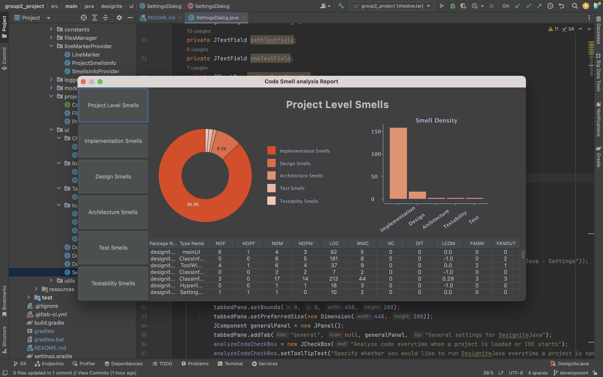

# IntelliJ plugin of DesigniteJava
The plugin analyzes your Java projects and detects implementation, design, architecture, test and testability code smells. 
It also computes common code quality metrics to measure complexity, cohesion, and coupling.
The plugin tags methods and classes within IntelliJ suffering from smells to motivate you to refactor the method or class. 
Also, the plugin shows a tool window that lists code quality information (i.e., smells and metrics) of the active file to keep an eye on the code quality.
It also shows in-line code smells with the help of a marker. There is a UI tool window that reports the total number of smells in 
the project with statistical data. 
The plugin uses DesigniteJava to analyze Java source code.

Note: As we started on an existing project, we followed the existing coding practices and tried to extend the original project as much as possible.

#### Build Instructions 
###### Prerequisites
1. Gradle 7.5.1
2. Java 17
3. Change gradle configuration:
   1. Open gradle folder in the project directory
   2. Open wrapper folder
   3. Open gradle-wrapper.properties 
   4. Update "distributionUrl" to distributionUrl=https\://services.gradle.org/distributions/gradle-7.5.1-bin.zip

###### Dependencies
1. 'org.mockito:mockito-inline:3.12.4' 
    
    Library added to provide the mocking framework
2. 'org.mockito:mockito-junit-jupiter:3.12.4' 
    
    Library added to provide the ide mocking framework
3. 'org.knowm.xchart:xchart:3.8.1' 
    
    Library added to create graphs on UI

###### Build 
- Run command “./gradlew shadowJar”

###### Install plugin
1.	Open IntelliJ
2.	Open IntelliJ settings
3.	Go to plugins
4.	Click on the settings icon and select install plugin from the disk
5.	Go to the project directory --> build --> libs --> select the .jar file

###### How to Run Plugin
1.	Go to Tools --> DesigniteJava > Analyze Code
2.	Wait for the processing to complete
3.	Restart IntelliJ
4.	On the bottom right side, you will find the DesigniteJava button click on that to see the code smells
5.	To see the UI, go to Tools --> DesigniteJava --> Analysis Report

###### Milestones
1.	Detect test smells - DONE
2.	Detect Architecture smells - DONE
3.	Show the progress bar on the Taskbar - DONE
4.	Navigating to the code lines on click of links in the DesigniteJava Tool window - DONE
5.	UI to show project-level information using charts and tables – DONE
      
###### Milestones added after the mid-term review
1.	Add testability smells - DONE

## Features

### 1. Project Level User-Interface:
The statistical format taken in UI depicts the smell distribution over the entire project
as well as the project level metrics.

### 2. Specific Snell User-Interface:
The statistical format taken in UI depicts the smell distribution over the entire project of a 
particular smell level i.e. design, implementation etc. It shows the various smell types that
occur in the project. 

### 3. Test smells: 
The test smells specific to a class can be seen in the tool window and the line marker with clickable links.

### 4. Architecture smells:
The architecture smells specific to that package can be seen in the tool window and the line marker with clickable links.

### 5. Testability smells:
The testability smells specific to a class can be seen in the tool window and the line marker with clickable links.

### 6. Progress Bar:
The video demonstrates the implementation of a progress bar in the project. 

[Click here to see demonstration of the Progress Bar](https://youtu.be/XpiTzPRpIfA)

### 7. Method Links:
The video demonstrates the functioning of method links added for test and implementation smells in Designite Tool window in the project.

[Click here to see demonstration](https://youtu.be/MQ3TxMR_MQ0)

### 8. Class Link:
The video demonstrates the functioning of Class links added for design and testability smells in the project.

[Click here to see demonstration](https://youtu.be/_Lbp1ES6VFE)

### 9. Package Link :
The video demonstrates the functioning of Package links added in Architecture smells in the project.

[Click here to see demonstration](https://youtu.be/xtCmkN4FShg)

## Smells
Existing coding practice have been followed during the addition of new features in the project.
This is why there are multiple smells.

Also, the creation of a user-interface required us to add a number of characteristics like 
height, width, border etc to the elements. That has resulted in a large number of magic number code 
smells. 

The link to smells list and their justifications is added 
[here](src/main/resources/Reports/CodeSmellSummary.xlsx)
      
## Contribution Statement and rating
The link to contribution statement for the group [here](src/main/resources/Reports/group2.docx)

### Link to Jira Board [Group: 2 Designite](https://group25308.atlassian.net/jira/software/projects/IIP/boards/1)

### Test coverage
- We were not able to achieve good test coverage as most of our project deals with file system and UI elements.
